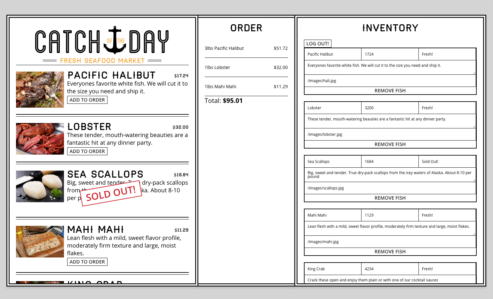

# Catch of the Day

A React app I built while taking the **React for Beginners** course taught by Wes Bos. It utilizes Firebase's real-time database and user authentication.

### View [working demo](https://nds-cotd.netlify.com)

- First provide a random name for your store
- Login using Github, Twitter, or Facebook
- Click `Load Sample Fishes` button to provide sample data

 

